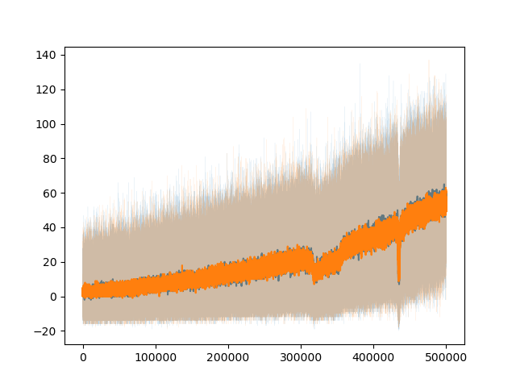
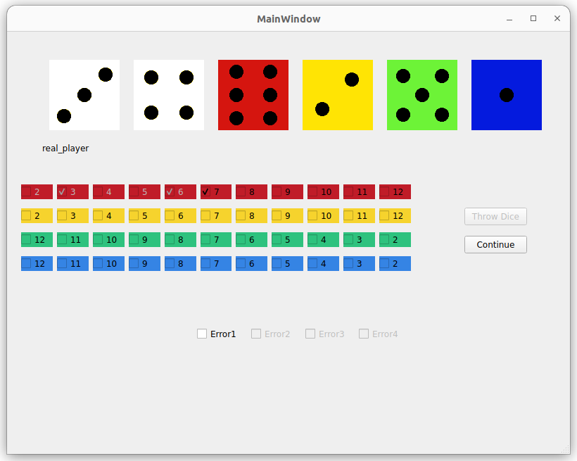

# Reinforcement Learning for Qwixx

This repository features a reinforcement learning agent trained to play the dice game [Qwixx](https://fgbradleys.com/wp-content/uploads/rules/Qwixx%20-%20rules.pdf). The agents compete against each other across multiple games, enhancing their strategies through experience. Additionally, a simple Qt GUI allows human players to compete against each other or against a trained bot.

You can choose between two neural network configurations: one that represents the current board as a boolean array (the "big net"), and another that counts free fields and sums the selected field with the furthest right selected field per row (the "small net").

|                                           | 
|:-------------------------------------------------------------------------------------------------------------:| 
| *Score of Two RL Agents (Big and Small Nets) Playing Against Each Other in 500k Games and moving avg. filter* |

To get started, install the required libraries and run the main script in either training or playing mode:

### Training Mode
```console
python main.py train -s <player1> -s <player2> -n big -n small -e <epochs>
```

### Playing Against a Trained Bot
```console
python main.py play -s <sim_player> -n big -r <real_player> # Add more players as needed
```

### Command Line Flags:
- `-r` : Real player
- `-s` : Simulated player (RL Agent)
- `-e` : Number of epochs (only applicable in training mode)
- `-n` : Network type for simulated players

|      | 
|:---------------------------------------:| 
| *Human Player Competing Against a Trained RL Bot* | 

Explore the game dynamics and see how the agents learn and adapt!